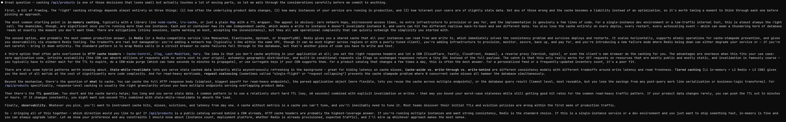
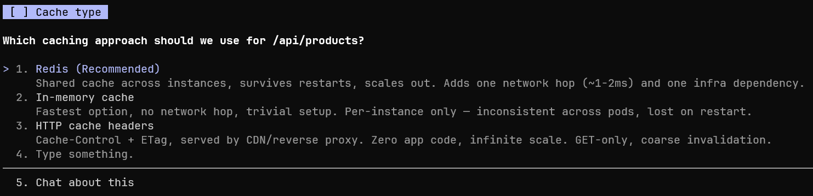

# Options Mode

<p align="center">
  
</p>

You give an agent a task. It works for a while, then comes back with a paragraph of preamble and a question buried at the end. You scroll, read, type a reply, hope it's clear enough — and the agent goes off again. Now multiply that by five agents you're babysitting in parallel. Or by the fact that you're driving from your phone on the train. The slow part isn't the model — it's you reading prose and typing replies.

I built **options-mode**, a plugin for Claude Code and GitHub Copilot CLI that forces every decision turn through the built-in choice-prompt tool. Instead of reading prose and typing a reply, you get a short list of clear options — one marked **Recommended** — and pick with arrow keys + Enter.

## Before / After

> **Normal:** Paragraphs of context. A question buried at the end. You scroll, read, type a reply, hope it's clear enough.



> **Options Mode:** Two to four labels on screen. Recommended one tagged. Arrow keys, Enter, done. Next turn fires.



Same decision. Seconds instead of a minute. Works the same in a terminal, on an iPad, or while triaging six agent windows.

## Why It Helps

- **Options at a glance.** Recommended choice marked, alternatives listed — no parsing prose to find the actual decision.
- **Zero typing.** Arrow keys + Enter. The keyboard barely moves.
- **Remote steering.** On a phone or tablet, tap the option you want. No touch-screen typing, no autocorrect duels.
- **Multi-agent context switching.** When five agents are blocked waiting for you, scanning labels and tapping is much cheaper than reading each one's verbose status and writing a reply back.

## Install

Register the marketplace once:

```text
/plugin marketplace add Evyatar108/options-mode
```

Install the plugin:

```text
/plugin install options-mode@options-mode --scope user
```

Restart your CLI after installation so SessionStart hooks are loaded. Works on Claude Code and GitHub Copilot CLI.

## Commands

- `/options-mode on` — enable choice-prompt enforcement for this session. Plain prose is allowed when the model marks the turn as not-a-question.
- `/options-mode strict` — like `on`, but **every** response back to the user must come with concrete options. The plain-prose escape is removed. Useful when next-step suggestions are usually obvious — the model surfaces them as choices and you continue with one keystroke instead of typing.
- `/options-mode auto` — like `strict`, but designed for unattended sessions. The `AskUserQuestion` dialog is intercepted before it renders — the model receives "The user isn't here right now, please try to continue as much as possible." and proceeds autonomously. Use `<options-mode>task-complete</options-mode>` to signal clean completion with no more work to do. The choices are still visible in the tool_use block in the conversation stream, but never surface as a blocking UI prompt.
- `/options-mode off` — disable enforcement for this session.
- `/options-mode status` — show the current effective mode.
- `/options-mode default on|off|strict|auto|clear|status` — manage the global default that applies to new sessions.

## Tag Protocol

Each mode uses specific tags as post-turn signals. Tags are substring-matched against the last assistant message on each surface.

| Tag | Claude Code (`hooks/config.js`) | Copilot CLI (`hooks/copilot-config.js`) | Valid in `on` | Valid in `strict` | Valid in `auto` |
| --- | --- | --- | --- | --- | --- |
| no-question | `<options-mode>no-question</options-mode>` | `[//]: # (options-mode-no-question)` | yes | **no** | **no** |
| background-task | `<options-mode>background-task</options-mode>` | `[//]: # (options-mode-background-task)` | yes | yes | yes |
| background-agent | `<options-mode>background-agent</options-mode>` | `[//]: # (options-mode-background-agent)` | yes | yes | yes |
| task-complete | `<options-mode>task-complete</options-mode>` | `[//]: # (options-mode-task-complete)` | **no** | **no** | yes |

`task-complete` signals that the task is genuinely done with nothing more to do. Valid only in `auto` mode. In `on`/`strict` modes use `AskUserQuestion`/`ask_user` to prompt the user instead.

## Internals

State files written under `<configRoot>` (default `~/.claude` for Claude Code, `~/.copilot` for Copilot CLI):

- `options-mode/sessions-configs/<sha256(session_id)[0:32]>` — per-session mode flag (`on`, `off`, `strict`, or `auto`). Directory created automatically on first write.
- `.options-active` — legacy single-machine fallback (pre-v0.4.0 / no session_id).
- `options.json` — global default (`{ "defaultMode": "on" }` etc.).
- `.options-statusline-warn` — sentinel: suppress the one-time statusline setup reminder after first display.
- `.options-stop-counter-<sha256>` — per-`(transcript, assistant-id)` loop counter; unlinked after 5 consecutive blocks.
- `options.log` / `options.log.1` — rotating audit log (64 KB cap).

## OS Support

Works on Linux, macOS, and Windows (Git Bash / WSL for Bash scripts; PowerShell for `.ps1` statusline).

The statusline badge requires either:

```json
"statusLine": { "type": "command", "command": "bash ${CLAUDE_PLUGIN_ROOT}/hooks/options-mode-statusline.sh" }
```

or:

```json
"statusLine": { "type": "command", "command": "pwsh -File ${CLAUDE_PLUGIN_ROOT}/hooks/options-mode-statusline.ps1" }
```

in `~/.claude/settings.json`.
